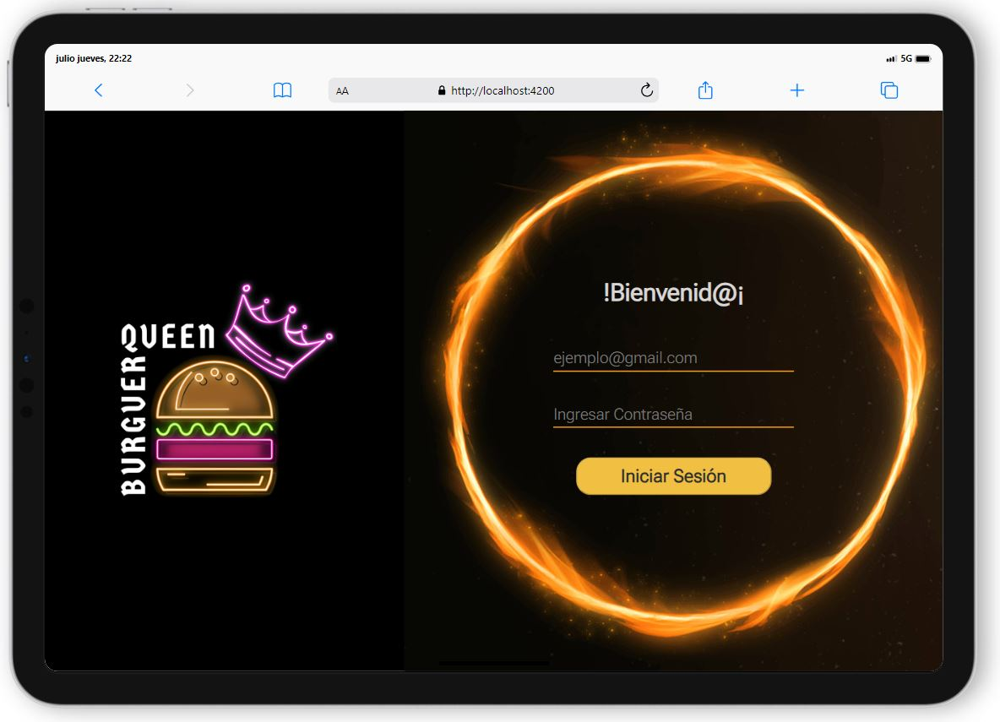
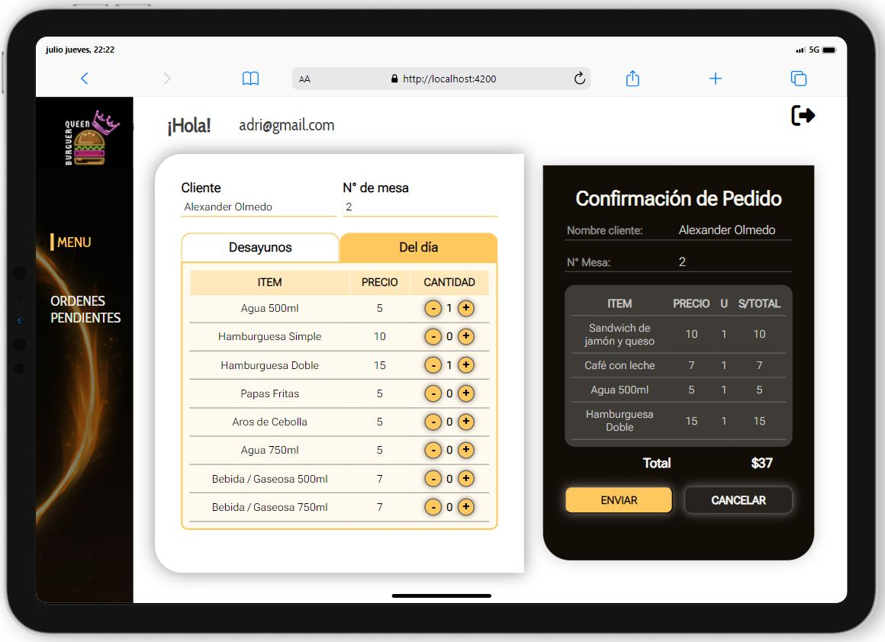
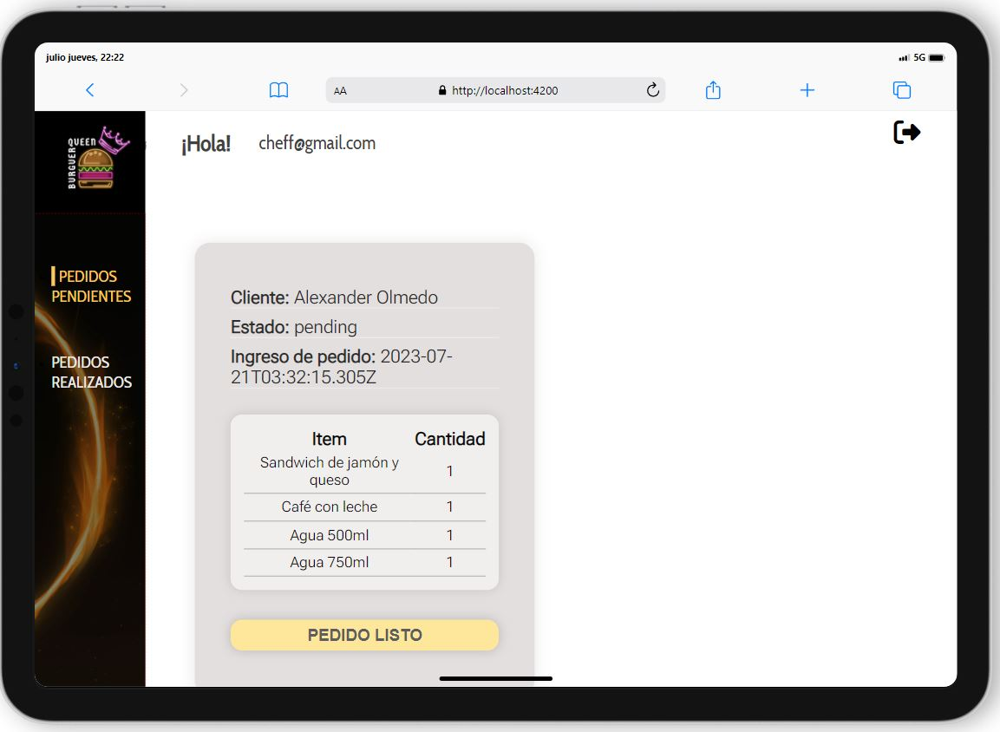

# Burger Queen (API Client)

## Índice

* [1. Resumen del proyecto](#2-resumen-del-proyecto)
* [2. Aplicación](#2-Aplicación)
* [3. Consideraciones](#3-consideraciones)

***
## 1. Resumen del proyecto

Un pequeño restaurante de hamburguesas, que está creciendo, necesita un
sistema a través del cual puedan tomar pedidos usando una _tablet_, y enviarlos
a la cocina para que se preparen ordenada y eficientemente.

Este proyecto tiene dos áreas: interfaz (cliente) y API (servidor). Nuestra
clienta nos ha solicitado desarrollar la interfaz que se integre con una API.

Esta vez tenemos un proyecto 100% por encargo. Si bien siempre puedes (y debes)
hacer sugerencias de mejoras y/o cambios, muchas veces trabajarás en proyectos
en los que primero hay que asegurarse de cumplir con lo requerido.

Esta es la información que tenemos de la clienta:

> Somos **Burguer Queen**, una cadena de comida 24hrs.
>
> Nuestra propuesta de servicio 24hrs ha tenido muy buena acogida y, para
> seguir creciendo, necesitamos un sistema que nos ayude a tomar los pedidos de
> nuestrxs clientxs.
>
> Tenemos 2 menús: uno muy sencillo para el desayuno:
>
> | Ítem                      |Precio $|
> |---------------------------|------|
> | Café americano            |    5 |
> | Café con leche            |    7 |
> | Sandwich de jamón y queso |   10 |
> | Jugo de frutas natural    |    7 |
>
> Y otro menú para el resto del día:
>
> | Ítem                      |Precio|
> |---------------------------|------|
> |**Hamburguesas**           |   **$**   |
> |Hamburguesa simple         |    10|
> |Hamburguesa doble          |    15|
> |**Acompañamientos**        |   **$**   |
> |Papas fritas               |     5|
> |Aros de cebolla            |     5|
> |**Para tomar**             |   **$**   |
> |Agua 500ml                 |     5|
> |Agua 750ml                 |     7|
> |Bebida/gaseosa 500ml       |     7|
> |Bebida/gaseosa 750ml       |     10|
>
> Nuestrxs clientxs son bastante indecisos, por lo que es muy común que cambien
> el pedido varias veces antes de finalizarlo.

La interfaz debe mostrar los dos menús (desayuno y resto del día), cada uno
con todos sus _productos_. La usuaria debe poder ir eligiendo qué _productos_
agregar y la interfaz debe ir mostrando el _resumen del pedido_ con el
costo total.

## 2. Aplicación
### Página de inicio

### Vista de mesero

### Vista de cheff

## 3. Consideraciones

Para poder ingresar a la aplicación web, se puede realizar con los siguientes accesos:

- Mesero : 
Email: adri@gmail.com
Contraseña: 123456

- Cheff : 
Email: cheff@gmail.com
Contraseña: 123456

